#### 概述
本项目使用了强化学习算法来优化SPARQL查询，使用的图数据库是[Apache Jena(TDB)](https://github.com/apache/jena)，版本是3.14.0。

#### 如何配置项目
1. clone此项目到本地，安装好[maven工具](https://maven.apache.org/download.cgi#)
2. 使用maven工具安装依赖
   ```
   mvn -Drat.skip=true install
   ```
3. 下载[LUBM数据集](https://github.com/rvesse/lubm-uba)，将数据集放到项目的Data目录下
   在生成lubm-uba项目时，建议选择生成命令：
   > ./generate.sh --quiet --timing -u 1000 --format NTRIPLES  --consolidate Partial --threads 8
   
   这样生成的.nt数据是分散在1000个小文件中的，方便择取部分数据导入数据库
4. 尝试使用maven编译，查看是否有错误，如果没有错误就配置完成
   > mvn -Drat.skip=true compile

#### 如何使用
1. 将代码StarterTDB.java中的
    ```java
    loadData(model, "./Data/LUBM/", "N-TRIPLE");
    ```
    取消注释，将"./Data/LUBM/"替换为导入数据的文件夹名称。
    注意：只需要导入数据的代码只需要执行一次，数据已经存入了数据库，之后再运行代码无需导入数据。
2. 在终端运行
   > ./run.sh

#### 如何训练
##### 优化器选择
在StarterTDB.java中有如下的优化器名称：
```java
String Optimizer = "Default";
String Optimizer = "QLearning";
String Optimizer = "DQN";
```
"Default"表示Jena自带的优化器
"QLearning"表示基于强化学习中的QLearning算法实现的优化器
"DQN"表示基于强化学习中的DQN算法实现的优化器
要使用哪个优化器，就将其他两个优化器的代码行注释掉
##### 用于训练的代码
在StarterTDB.java中有
```java
RLTrain(QLearning, trainQueryList, 200);
```
的代码，用于批量训练模型，200表示训练的轮数，trainQueryList代表用于训练的查询集，运行这个函数就可以训练模型了。

如果想单次执行一个查询，可以运行以下代码：
```java
singleRun(QLearning, query);
```
query是Jena的Query对象

如果想单次运行一个查询集，可以运行以下代码：
```java
runQuerySet(QLearning, trainQueryList);
```
trainQueryList代表用于执行的查询集，是一个List\<Query\>对象

#### 代码介绍


#### 优化效果
数据集1的运行效果：
训练查询集：
|            | Query1 | Query2 | Query3 | Query4 | Query5 | Query6 | Query7 | Query8 | 求和  |
| ---------- | ------ | ------ | ------ | ------ | ------ | ------ | ------ | ------ | ----- |
| Jena优化器 | 649    | 3      | 2      | 1      | 20     | 1      | 19019  | 1      | 19047 |
| Q学习      | 179    | 12     | 7      | 1      | 9      | 2      | 10946  | 2      | 11158 |
| DQN        | 6313   | 9      | 1      | 1      | 2      | 1      | 2611   | 1      | 8939  |
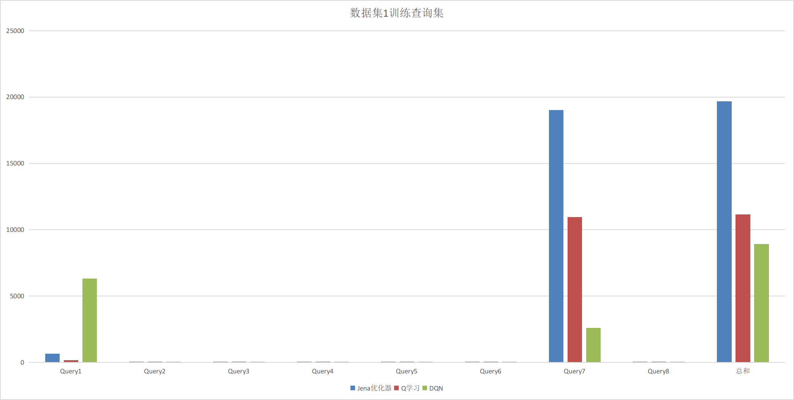

测试查询集：
|            | Query1 | Query2 | Query3 | Query4 | Query5 | Query6 | 求和 |
| ---------- | ------ | ------ | ------ | ------ | ------ | ------ | ---- |
| Jena优化器 | 150    | 1072   | 1      | 9      | 94     | 5      | 1331 |
| Q学习      | 232    | 668    | 2      | 1      | 3      | 1      | 907  |
| DQN        | 214    | 544    | 1      | 2      | 2      | 1      | 764  |
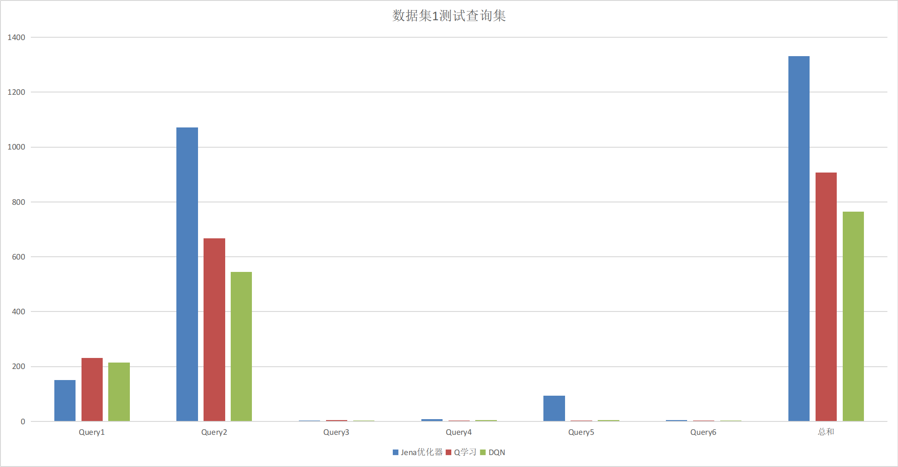

数据集2的运行效果：
训练查询集：
|            | Query1 | Query2 | Query3 | Query4 | Query5 | Query6 | Query7 | Query8 | 求和 |
| ---------- | ------ | ------ | ------ | ------ | ------ | ------ | ------ | ------ | ---- |
| Jena优化器 | 383    | 3      | 3      | 1      | 16     | 2      | 539    | 2      | 949  |
| Q学习      | 830    | 6      | 1      | 2      | 2      | 2      | 123    | 2      | 968  |
| DQN        | 186    | 20     | 3      | 2      | 2      | 3      | 291    | 2      | 507  |
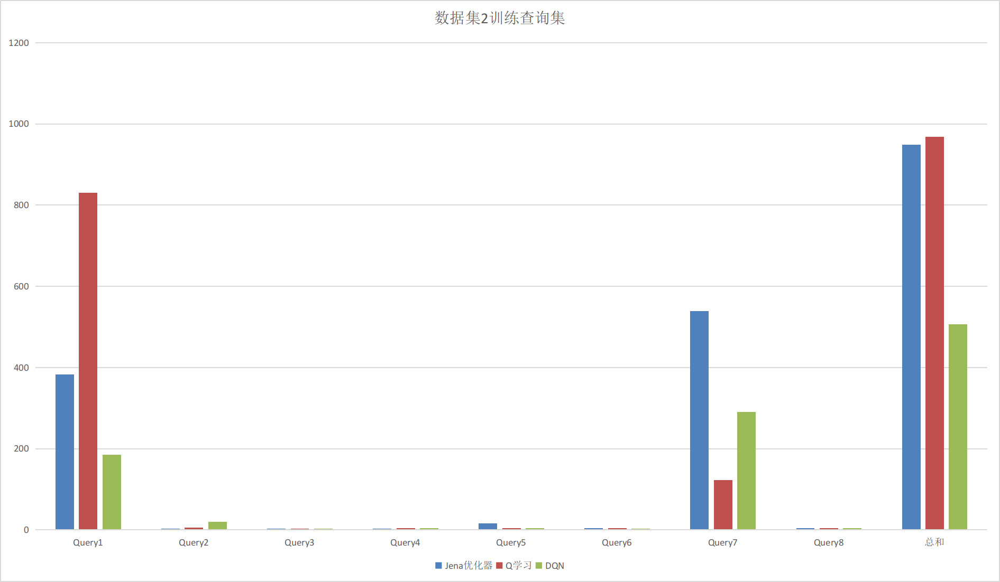

测试查询集：
|            | Query1 | Query2 | Query3 | Query4 | Query5 | Query6 | 求和 |
| ---------- | ------ | ------ | ------ | ------ | ------ | ------ | ---- |
| Jena优化器 | 154    | 190    | 27     | 12     | 83     | 8      | 474  |
| Q学习      | 217    | 184    | 3      | 13     | 1      | 2      | 420  |
| DQN        | 202    | 147    | 1      | 21     | 2      | 2      | 375  |
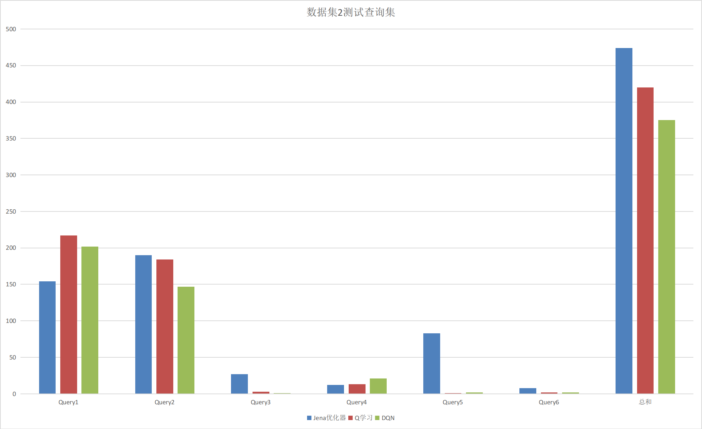

数据运行结果截图：
数据集1：
训练查询集：
1. Jena优化器：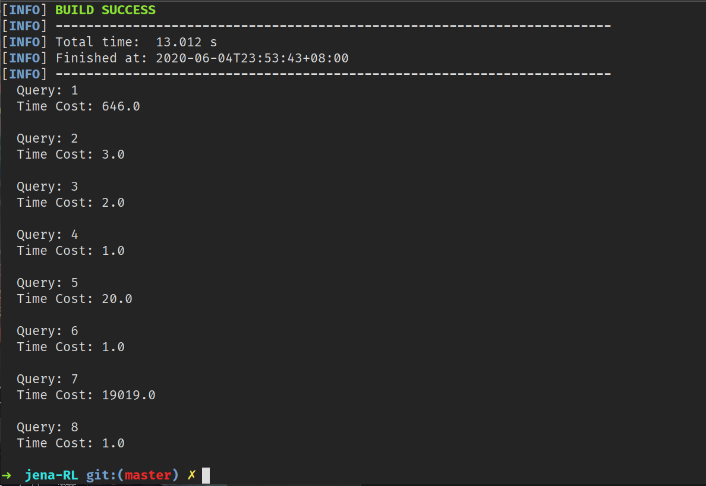
2. Q学习：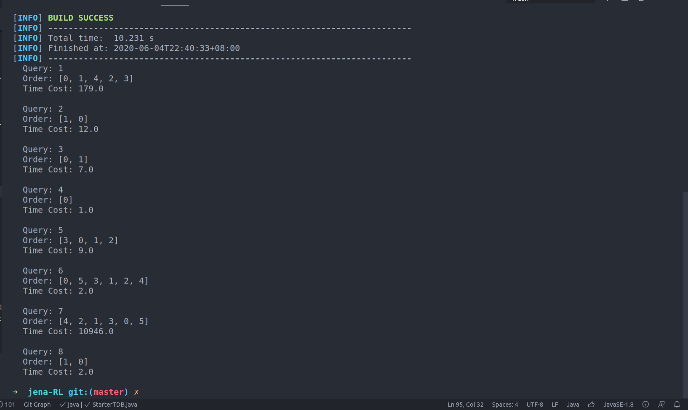
3. DQN 
测试查询集：
1. Jena优化器：
2. Q学习：
3. DQN 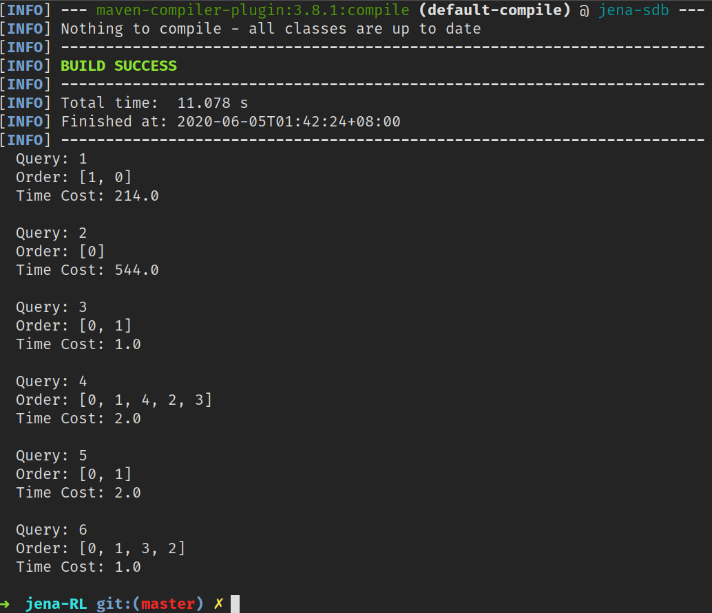

数据集2：
训练查询集：
1. Jena优化器：
2. Q学习：
3. DQN 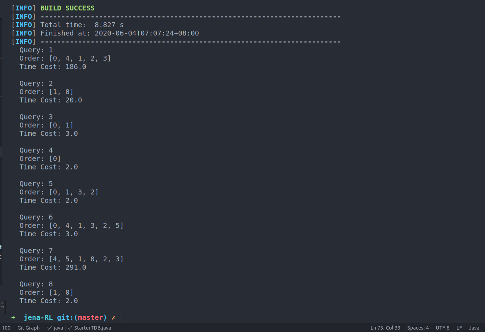
测试查询集：
1. Jena优化器：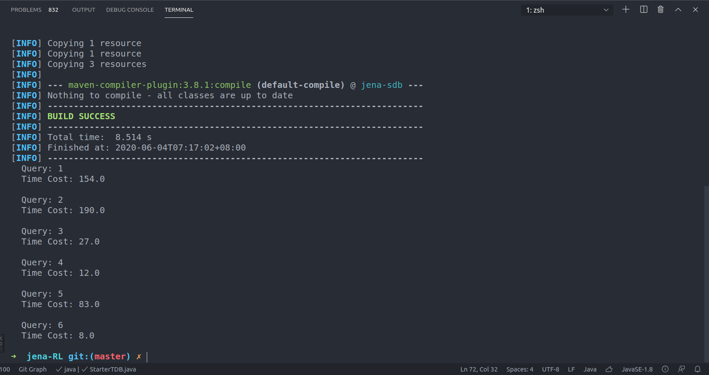
2. Q学习：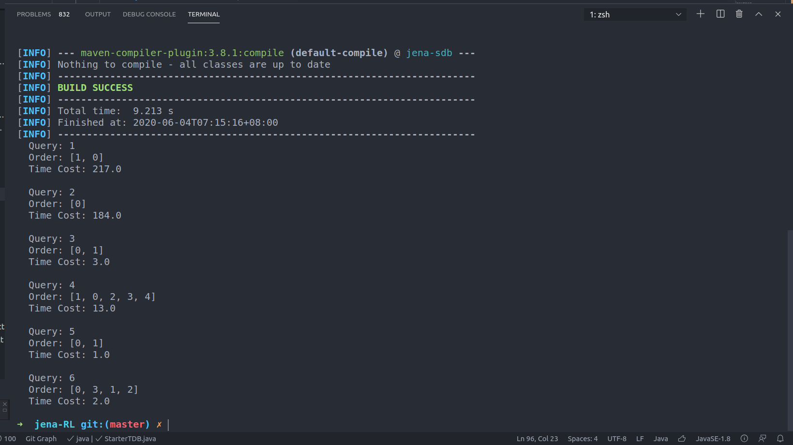
3. DQN 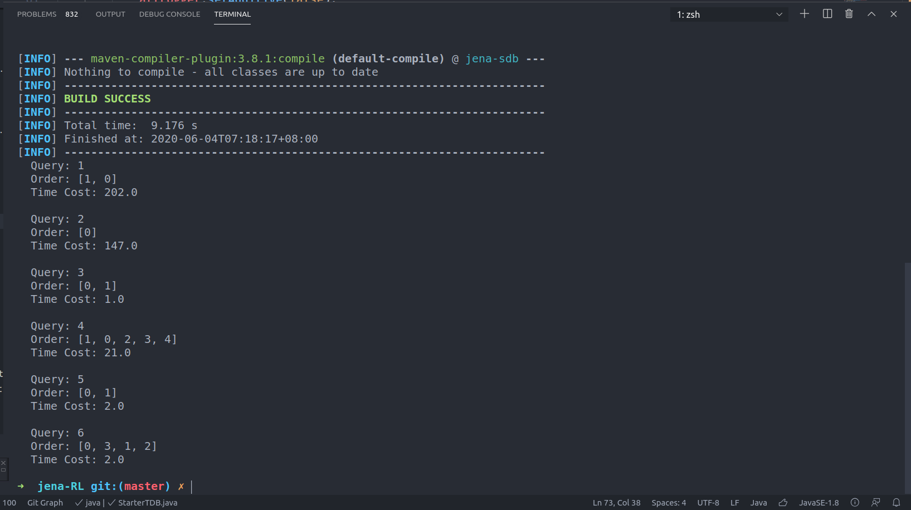